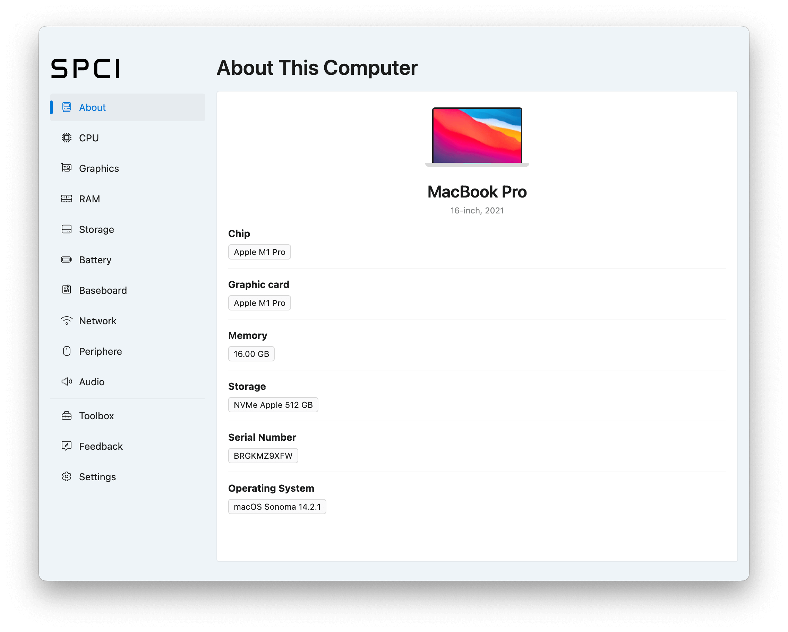

# SPCI

  

## Description

Analyze your computer’s hardware, check issues, and generate a full system report before buying or selling:
- Identify and highlight any dead pixels on your screen quickly and easily.
- Ensure all keys on your keyboard are functioning properly.
- Test your microphone and speakers for clear and accurate audio performance.
- Generate a detailed report on your system’s hardware and specifications.
- Access the application in 8 different languages for global usability.
- View detailed information about every component in your computer.

## Downloads

1. Go to the [Releases](https://github.com/Aspedm/SPCI/releases) section of this repository.
2. Download the latest version of the application:
   - Select the appropriate file format.
3. Follow the installation instructions.

## Installation instructions
#### Windows

1. Run `SPCI.exe`
2. Done :)

#### MacOS
1. Open terminal app
2. Paste command `xattr -rd com.apple.quarantine /path/to/SPCI.app`
3. Run application
4. Done :)

## Updates

To check for and install updates:
1. Go to the [Releases](https://github.com/Aspedm/SPCI/releases) section and download the latest version.
2. Replace the old version with the new build.

## Additional Information

- [Official Website](https://spci.io)
- [Privacy Policy](https://www.spci.io/privacy/)
- [Terms of Use](https://www.spci.io/terms/)